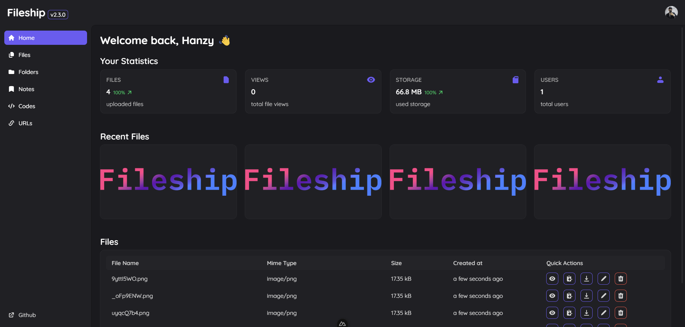

<div align="center">
  <a href="https://github.com/hanzydev/Fileship">
    
  </a>

  <p align="center">
    Fileship is an open-source and self-hosted image uploading service with cool features.
    <br />
    <br />
    <a href="https://github.com/hanzydev/Fileship/issues">Report Bug</a>
    ·
    <a href="https://github.com/hanzydev/Fileship/issues">Request Feature</a>
  </p>
</div>

## 📸 Screenshot



## 🧰 Built With


## 📦 Features

- Fast & Secure
- Self-hosted
- Easy to Use
- Vibrant Themes
- Statistics
- OpenGraph Embeds
- Folders
- Notes
- Backups
- Image Compression
- Custom Domains
- Chunked Uploads
- AI Powered Image Search
- Multi-Factor Authentication
- Multi-User Support
- Real-Time Updates
- Password Protection
- Video Thumbnails
- Auto-Delete after Views
- Auto-Delete after expiration
- Ambient Mode

## 🚀 Getting Started

### Minimum system requirements

Fileship is designed to run on a variety of systems, but the following minimum requirements are recommended for optimal performance:

- **CPU**: 2 Core
- **RAM**: 4 GB
- **Disk Space**: 4 GB (plus space for uploaded files)
- **Database**: PostgreSQL 16.x or higher
- **Node.js**: 20.x or higher

### Installing

This section requires [Docker](https://www.docker.com/) and [Docker Compose](https://docs.docker.com/compose/) to be installed on your machine.

```sh
git clone https://github.com/hanzydev/Fileship.git
cd Fileship
docker compose up -d
```

Open your browser and go to `http://localhost:3000`

### Default credentials

- Username: `admin`
- Password: `password`

### Web server configuration (optional)

This section requires [Nginx](https://nginx.org/) to be installed on your machine.

```nginx
server {
    listen 80;
    server_name <domain>;

    client_max_body_size 100M;

    location / {
        proxy_set_header X-Forwarded-For $proxy_add_x_forwarded_for;
        proxy_set_header Host $host;
        proxy_pass http://127.0.0.1:3000;
    }

    location /socket.io/ {
        proxy_set_header X-Forwarded-For $proxy_add_x_forwarded_for;
        proxy_set_header Host $host;
        proxy_pass http://127.0.0.1:3000;
        proxy_http_version 1.1;
        proxy_set_header Upgrade $http_upgrade;
        proxy_set_header Connection "upgrade";
    }
}
```

## 🔄 Updating

To update Fileship, follow these steps:

```sh
cd Fileship
git pull
docker compose up --build -d
```

## 📊 Telemetry

Fileship collects **telemetry data** about general usage to help us accurately gauge feature usage and customization. This data is essential for guiding future development, prioritizing features, and improving the overall user experience.

**This feature is completely optional.** You have full control over data collection and can easily opt-out if you do not wish to share any information.

### What data is collected?

The telemetry module collects the following types of data:

- **Fileship Instance Information**: General statistics about your Fileship setup (e.g., app version, counts of files, users, folders and notes) and the Node.js version it's running on. This helps us understand the scale and usage patterns of Fileship instances.
- **System Information**: Non-identifying details about the host system (e.g., OS platform, release, architecture, CPU count/model, memory, disk usage, and whether it's running in Docker). This helps us optimize performance across different environments.
- **AI Search Usage**: Usage statistics for the AI search feature, including the number of results and search duration. **Important: This includes the actual search query text entered by the user.** This data is collected to improve the relevance and performance of the AI search feature.

**No personally identifiable information (PII) beyond the search query is collected.** All other collected data is anonymous and used in aggregate for statistical analysis.

### How to Opt-Out

To disable all telemetry data collection, you need to set the `TELEMETRY_ENABLED` environment variable to `false`.

By default, telemetry is enabled to help us improve Fileship.

## ❤️ Contribute

Contributions are always welcome! Please read the [contribution guidelines](CONTRIBUTING.md) first.

## ⚖️ License

[MIT](LICENSE)
